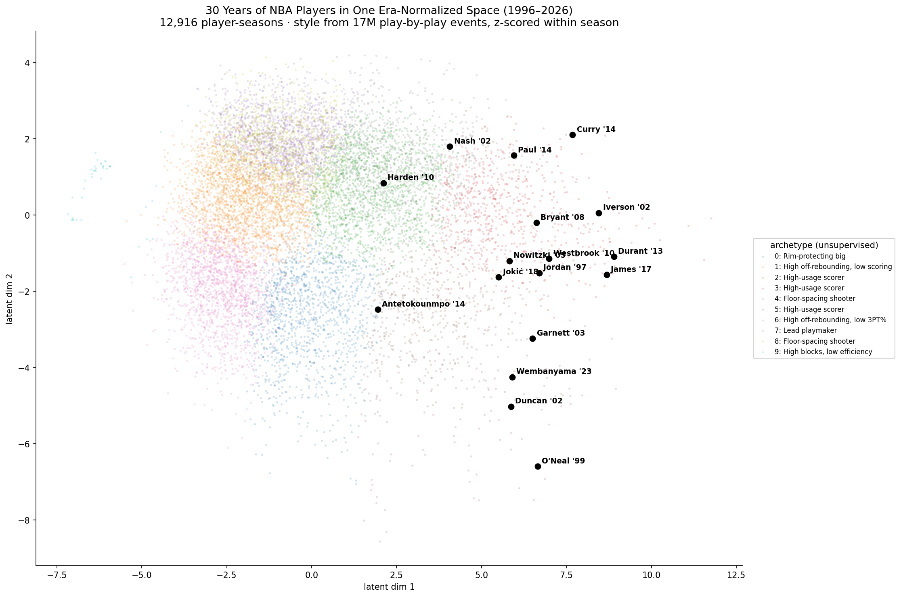

# NBA Players Across 30 Years, in One Latent Space

**Who is the cross-era version of any NBA player?** This project places **12,916
player-seasons (1996–2026)** into a single, era-normalized latent space — so a
1990s player and a 2020s player are directly comparable despite the league
changing underneath them — and finds each player's closest analogs in other eras,
fully unsupervised.



## The result (no labels, no supervision)

| Player | Closest cross-era analogs |
|---|---|
| **Michael Jordan** | Kobe Bryant, Carmelo Anthony, Jaylen Brown |
| **Shaquille O'Neal** | Tim Duncan, Jermaine O'Neal, Joel Embiid, Anthony Davis |
| **Steve Nash** | Chris Paul, Chauncey Billups, Darius Garland |
| **Nikola Jokić** | Domantas Sabonis, Bam Adebayo, Scottie Barnes |
| **Allen Iverson** | De'Aaron Fox, Tyrese Maxey, Donovan Mitchell |
| **Victor Wembanyama** | Kristaps Porziņģis, Anthony Davis, Joel Embiid |

The precomputed embedding ships in `./data`, so you can query any player with **no
raw data and no GPU**:

```bash
pip install -r requirements.txt
python -m cross_era.report comp "LeBron James"
```
```
Cross-era comps for LeBron James (2017-18):
   0.954  Pascal Siakam (2022-23)
   0.951  Kevin Durant (2021-22)
   0.951  Luka Dončić (2023-24)
   0.948  Paul George (2020-21)
   ...
```

## Why it's non-trivial

Raw box-score stats aren't comparable across eras — league-average three-point
attempts roughly **doubled** between 1998 and 2023. The pipeline:

1. **Builds** per-(player, season) style + production profiles from **~17M
   play-by-play events** (30 seasons), plus physical attributes (height/weight/age).
2. **Era-normalizes** every feature *within each season* (z-score vs that season's
   peers), removing league-wide trends — the 3PT revolution, pace — so what remains
   is *how a player played relative to their own era*.
3. **Embeds** (PCA) and ranks **cosine** similarity for cross-era analogs and
   KMeans archetypes (rim-protecting bigs, floor-spacing shooters, lead playmakers,
   high-usage scorers, …).

The map's vertical axis separates guards from bigs and the high-usage stars sit on
the outer edge — structure the model found on its own.

## Commands

```bash
python -m cross_era.report comp "Player Name"   # cross-era analogs (uses bundled data)
python -m cross_era.report catalog              # the archetype catalog
python -m cross_era.render                       # regenerate the map image
python -m cross_era.report report                # catalog + 2D coords + markdown writeup

# Rebuild the embedding from scratch (needs the raw play-by-play event store):
export NBA_EVENTS_DIR=/path/to/events   # folder of <year>.parquet, 1996..2025
python -m cross_era.build
```

## Layout

```
cross_era/   config · build (events→embedding) · report (query/catalog) · render (figure)
data/        precomputed embeddings, profiles, 2D coords, archetypes, bios  (demo runs from here)
assets/      cross_era_map.png
```

## Method notes

- **Era normalization** (z within season) is what makes cross-decade comparison
  valid — it's the core idea, not an afterthought.
- Profiles are aggregated directly from play-by-play (shots, rebounds, assists,
  steals, blocks, turnovers, free throws), so they're independent of any single
  box-score data source.
- Fully reproducible; unsupervised end to end (PCA + KMeans + cosine).

## Scope

A representation/analysis artifact for understanding and comparing players across
eras. **Not** a betting tool — it makes no claim to predict outcomes or beat a
market.

## License

MIT — see [LICENSE](LICENSE).
